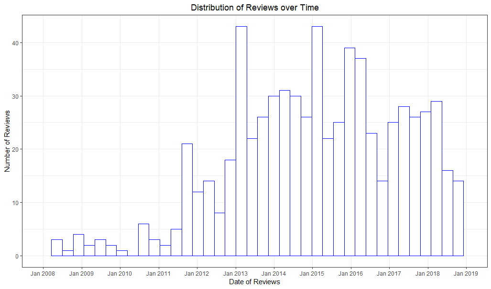
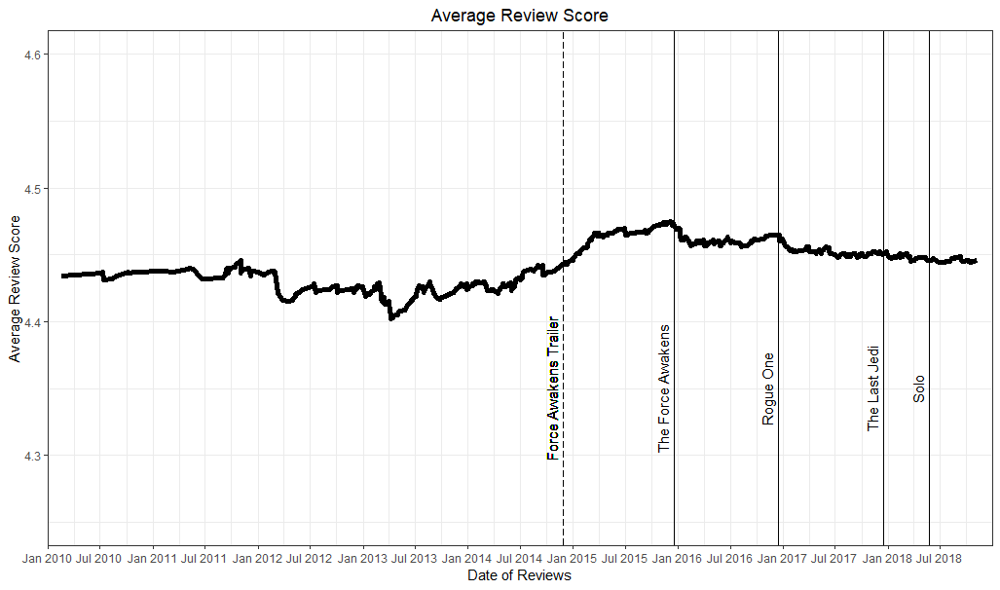

# Amazon Reviews Web Scraping
## Summary
Creating a simple R function using [rvest](https://github.com/hadley/rvest) to scrape the Date, Title, Text, Score and Country of all reviews for a given Amazon product ID from both Amazon US and Amazon UK.

## Function Overview
The extract_reviews function can be used by sourcing [func_scrape_amazon_reviews.R](func_scrape_amazon_reviews.R). It takes two arguments – the first is a text string containing the unique product ID for the product you’re interested in (this is the alphanumeric string immediately following “/dp/” in the product’s URL). The second argument is optional with a default value of 5 – it specifies how long (in seconds) to pause between scraping each page of reviews.

## Exploratory Analysis
To test out the function I've used it to extract all reviews for the Thrawn trilogy of Star Wars novels. The first of these, Heir to the Empire, is probably the most popular Star Wars EU book ever written, so I was interested in how the new Star Wars movies impacted its popularity and average rating.

### Getting the Data
Step one is sourcing the function and using it to extract the review data from all 1,045 reviews for Heir to the Empire (product ID 0553296124).

``` r
source("func_scrape_amazon_reviews.R")
library(dplyr)
library(ggplot2)

heir_data <- extract_reviews("0553296124", 8)
head(heir_data, 2) 

#>  Date        Title                            Review_Text                               Review_Score Country
#> 1 2017-01-09 a well-written Star Wars novel   This was the first novel of the Star War~            4 UK     
#> 2 2016-03-11 This trilogy is a must read for~ Timothy Zahn is a great writer and story~            5 UK  

```

### Review Frequency Over Time
First up, let's have a look at the distribution over time of reviews from the beginning of 2008 to the end of 2018.

``` r
review_score_data <- heir_data[, c("Date", "Review_Score")]
review_score_data$Date <- as.Date(review_score_data$Date)

ggplot(review_score_data, aes(x=Date)) +
     geom_histogram(fill = "white", color = "blue", bins = 40) +
     theme_bw() +
     theme(plot.title = element_text(hjust = 0.5), panel.grid.minor.x = element_blank()) +
     labs(x = "Date of Reviews", y = "Number of Review", title = "Distribution of Reviews over Time") +
     scale_x_date(date_breaks = "1 year", date_labels = "%b %Y", limits = as.Date(c('2008-01-01','2018-12-31')))
```

Review frequency is sporadic prior to 2011 but becomes more consistent from the second half of 2011. Going forwards we'll focus on data from 2012 onwards.

### Cumulative Review Score
The next thing to look at is how the cumulative average review score changed over time. Although I'm only plotting from 2012 onwards, the older reviews are being included in the cumulative average.
``` r
review_score_data <- arrange(review_score_data, Date)
review_score_data$avg_review <- round(cummean(review_score_data$Review_Score), 3)

## A date can have multiple reviews (thus multiple rows in the above table), here we take the last row for each date
cum_avg_review <- review_score_data %>% 
  group_by(Date) %>% 
  slice(n())

movie_releases <- data.frame("movies" = c("The Force Awakens", "Rogue One", "The Last Jedi", "Solo"),
                             "release_dates" = as.Date(c("2015-12-18", "2016-12-16", "2017-12-15", "2018-05-25")))

ggplot(cum_avg_review, aes(x=Date, y=avg_review)) +
  geom_line(size = 2) +
  theme_bw() +
  ylim(4.25,4.6) +  
  ylab("Average Review Score") +
  scale_x_date(date_breaks = "6 month", date_labels = "%b %Y", limits = as.Date(c('2010-01-01','2018-12-31')), expand=c(0,0)) +
  geom_vline(xintercept = movie_releases$release_dates) + 
  geom_text(data = movie_releases, aes(x=release_dates, y = 4.35), label=movie_releases$movies, vjust=-0.5, size=4, angle = 90) +
  geom_vline(xintercept = as.Date("2014-11-28"), linetype="longdash") +
  geom_text(x=as.Date("2014-11-28"), y = 4.35, label="Force Awakens Trailer", vjust=-0.5, size=4, angle = 90)
```

The average review score is relatively stable (as it's the mean of several hundred previous scores) but it steadily increases to a peak in the build-up to The Force Awakens being released, then decreases slightly until a second peak around the release of Rogue One.
